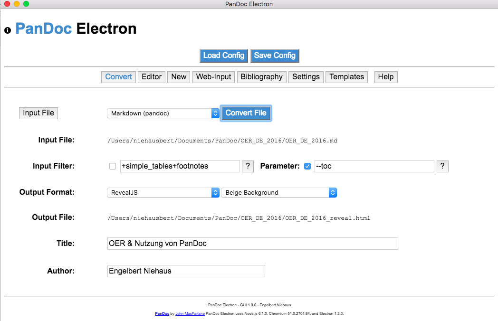

Wiki-Formate als Datensenken
----------------------------
WikiMedia-Syntax wird als Format in

- Wikipedia 
- Wikiversity (OER)
- OLAT (closed Doc Development)
- ....

verwendet.

WikiMedia-Konzept
-----------------

- Offene kollaborative Inhaltsentwicklung
- Versionierung der Inhalte 
- Diskussionsseiten jeweils zu allen Inhalten
- Qualtitätsicherung mit externer Github-Versionierung und Querverweis zu Wiki-Referenz

Wikiversity und Bildungsprozesse
--------------------------------

- Primary Education (Grundschulen)
- Secondary Education (Weiterführende Schulen)
- Tertiary Education (Universitäten)
- Non-formal Education (Handwerkliche Techniken, Alltagswissen, ...)

Aus Datensenken andere Formate erzeugen
---------------------------------------

-   Markdown
-   Präsentationen (RevealJS, DZSlides, LaTeX Beamer)
-   LibreOffice-Dokumente mit Style-Templates,
-   Microsoft Office-Dokumente mit Style-Templates,
-   LaTeX-Dokumente,
-   PDF, ...

PanDoc Electron
---------------

Electron = Browser mit vollem Zugriff auf das Dateisystem

Reveal-Präsentationen
---------------------

-   In standard [reveal.js](https://github.com/hakimel/reveal.js)
    presentations mathematical formulas are rendered with MathJax by
    importing the MathJax libraries via internet access.
-   This has the disadvantage that mathematical formulas are not
    rendered, when you do not have internet connectivity or the MathJax
    libraries are removed from the browser cache.
-   The local MathJax libraries avoid these problems. The content of the
    "mathjax" folder can be replaces by newer versions of "MathJax"
-   URL: <https://github.com/mathjax/MathJax>
-   Homepage: <http://www.mathjax.org>

Mathemtatik
-----------

-   z.B. Taylorentwickung $f(x)=\sum_{n=0}^\infty\frac{f^{(n)}(a)}{n!}(x-a)^n$\
    Abgesetzte mathematische Formeln
    $$ \displaystyle  \left( \sum_{k=1}^n a_k b_k \right)^2 \leq \left( \sum_{k=1}^n a_k^2 \right) \left( \sum_{k=1}^n b_k^2 \right) $$
- Grundlage LaTeX with in WikiMedia, MathJax, ... unterstützt

Folder Audio Video:
-------------------

-   if you use media files create subdirectories in the project
    directory call for different media files with subfolders */audio*,
    */video* and */images*
-   the folders contain all media files (Video, Audio, Images, ...) that
    are used in the reveal presentation or other PanDoc export formats.

Commands for MarkDown
---------------------

-   The file *README\_pres.txt* is e.g. a text file in MarkDown and
    converted into Reveal.
-   The following PanDoc command creates a reveal presentation
    from Markdown.

<!-- -->

    pandoc -t html5 --template=tpl4reveal.html \
          --standalone --section-divs \
          --variable theme='beige' \
          --variable transition="slide" \
          slides.md -o slides.html

Commands for WikiMedia
----------------------

-   Source Files from Wikipedia (e.g. Edit Article) can be retrieved and
    stored as text file.
-   The following PanDoc command creates a reveal presentation from the
    Wikipedia file *"wikipedia.wiki"*.

<!-- -->

    pandoc -f mediawiki -t html5 --template=tpl4reveal.html \
         --standalone --section-divs \
         --variable theme='beige' \
         --variable transition="slide" --mathjax \
         wikipedia.wiki -o wikipedia.html

Learning Markdown & WikiMedia
-----------------------------

-   Learning Markdown <http://www.markdowntutorial.com>
-   Learning WikiMedia
    <https://en.wikipedia.org/wiki/Wikipedia:Tutorial>

